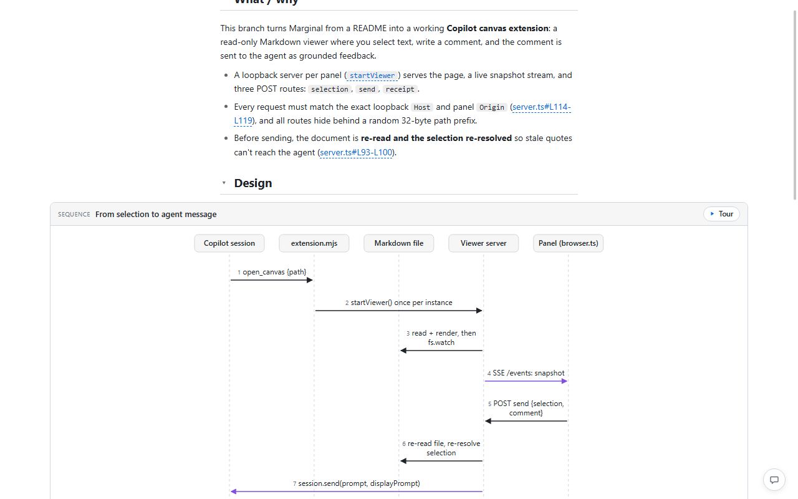
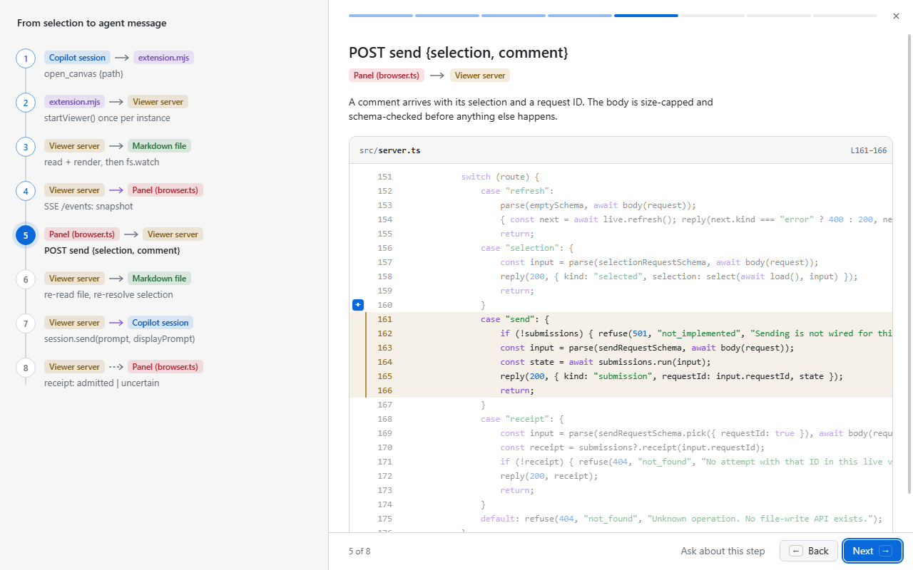
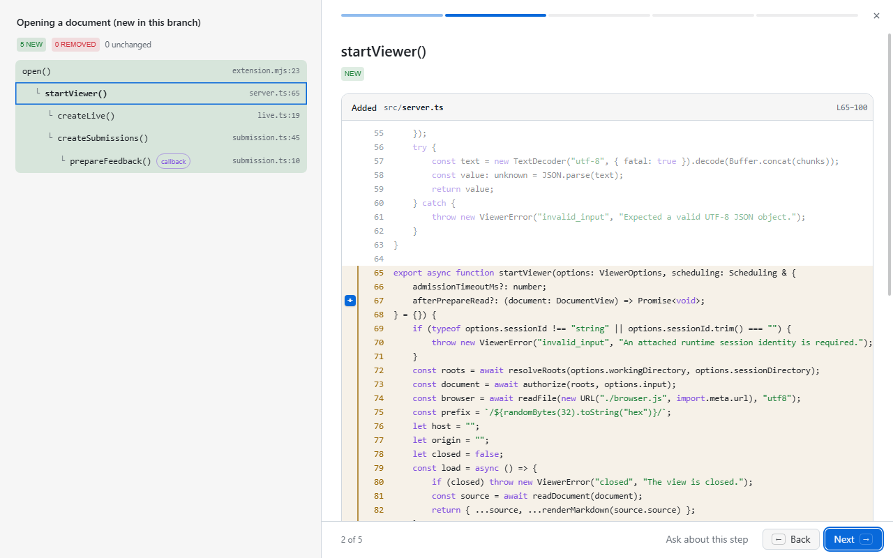
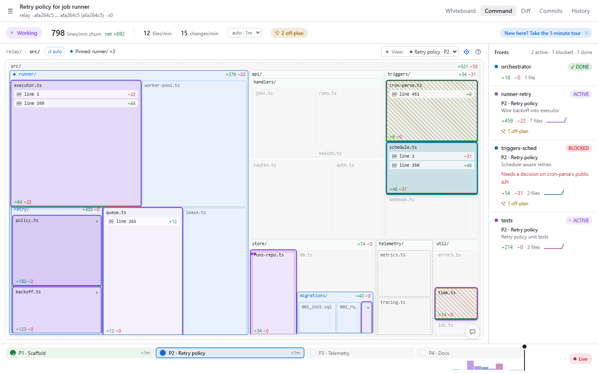
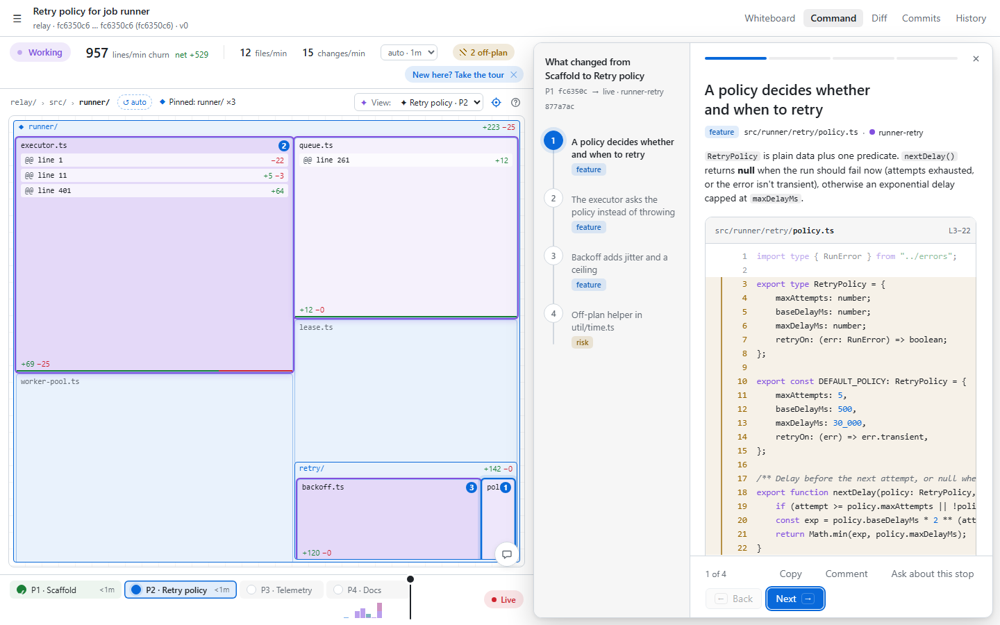
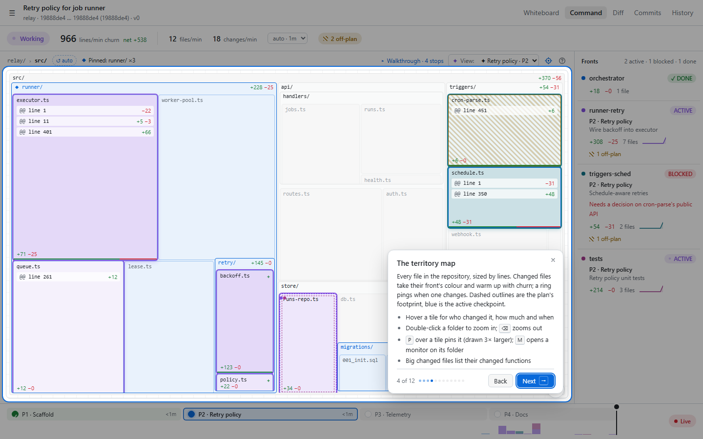

# Marginal

**Code-linked whiteboards and a live Command center for GitHub Copilot.**

Marginal is a canvas extension for the [GitHub Copilot app](https://docs.github.com/en/copilot/how-tos/github-copilot-app/working-with-canvas-extensions). Copilot draws structured, reviewable explanations of your code. They're RFC-style documents with sequence and flow diagrams, call-stack diffs, schema lenses and verified code peeks. You can comment on any paragraph or diagram and the feedback goes straight back to the agent. When Copilot implements a multi-step plan across several worktrees, the **Command center** tab turns the whiteboard into a live mission wall: a territory map of the repository lights up as each worktree edits files.

> **Status: alpha.** It depends on the Copilot SDK's canvas extension surface, which is marked **experimental** and may change between Copilot releases.



## What you get

### Whiteboards

- **Blocks the agent can draw:** Markdown, sections, callouts, code, `code_peek` (verified slices of real files at pinned commits), sequence diagrams, flow diagrams, call-stack diffs, database lenses, trace quotes and images. Blocks are validated at write time, so every file reference resolves.
- **Code tours:** sequence and flow diagrams have a **Tour** mode that steps through the diagram beside the code. Call-stack diffs have a **Focus** view.
- **Comment on anything:** hover a paragraph, list item, diagram or code range to get margin controls for *Comment* and *Copy*. Ctrl/Cmd-click or Shift-click selects several at once. Code views support GitHub-style gutter line selection.
- **Side chat:** a small, draggable chat whose replies stream from your Copilot session, scoped to what you pointed at.
- **Diff, Commits and History tabs** for the change the whiteboard explains, including agent-authored *file lenses* that group changed files.
- **Scratchpad:** an always-present whiteboard for quick sketches that aren't tied to a branch.

| Code tour | Call-stack focus |
|---|---|
|  |  |

### Command center



- **Territory map:** every file in the repository, sized by lines of code. Changed files take their worktree's colour and warm with churn, and a ring pings on each change. Dashed outlines show the plan's footprint and blue shows the active checkpoint. Edits outside the plan get a yellow hatch.
- **Fronts:** one per worktree, attributed by watching git, never by agent self-report. Each has its status, place in the plan, recent pace and off-plan count.
- **Checkpoints and replay:** the plan's phases on a timeline. Scrub the histogram to see the map as it was at any moment.
- **Views, follow, pins and monitors:** the agent can suggest a view per checkpoint, and it applies automatically while you follow. You can pin areas to draw them 3× larger, or open live diff-feed monitors on folders.
- **Checkpoint walkthroughs:** ask "walk me through the last checkpoint" to get a stepper with one stop per idea, each with its diff. The map zooms and badges each stop's files, and Copilot revises stops in place when you ask about them.
- **Command chat:** a persistent chat with the orchestrating session. Point at tiles, fronts, checkpoints or walkthrough stops to attach them as focus chips.
- **Guided tour:** press **?** (or click the **?** in the map header) for a one-minute tour of all of the above.

| Walkthrough | Guided tour |
|---|---|
|  |  |

## Install

Requirements: the GitHub Copilot app with canvas extensions, and `git` on your `PATH`. There is nothing to build and there are no npm dependencies; the Copilot runtime supplies `@github/copilot-sdk`.

Install for yourself (all repositories):

```sh
git clone https://github.com/<owner>/marginal ~/.copilot/extensions/whiteboard
```

On Windows, the target is `%USERPROFILE%\.copilot\extensions\whiteboard`. You can also install it for one repository by cloning into `.github/extensions/whiteboard/` in that repository. Then reload extensions: restart the app, or ask Copilot to reload extensions.

The canvas registers as **Whiteboard** (canvas id `whiteboard`).

## Use

Ask Copilot things like:

- "Explain my branch on the whiteboard."
- "Sketch how checkout calls the payment service on the scratchpad."
- "Group the changed files into lenses."

The agent calls the canvas's `instructions` action first (topics: `authoring`, `scratchpad`, `blocks`, `file-lenses`, `command`), then draws with actions such as `create`, `edit`, `read_file`, `diff` and `lens`.

**Command center.** Open a whiteboard that has a repository target and switch to the **Command** tab.

- Click **Initialize command center**, optionally describing the goal. This session reads the whiteboard and the branch, sets a plan, and registers the worktrees being edited.
- Alternatively, ask the agent to follow the `command` instructions topic when it starts a multi-step implementation.

The protocol is described in [docs/command-center.md](docs/command-center.md).

## How it works

- `extension.mjs` joins the Copilot session with `joinSession()` and declares the canvas and its actions with `createCanvas()`. Each panel is served by a local HTTP server bound to `127.0.0.1`; every request needs a random per-panel token.
- Whiteboards, pins and the Command center's state and event log live in `artifacts/`, next to the extension. That folder is git-ignored and never leaves your machine. Set `WHITEBOARD_DATA_DIR` to store them elsewhere.
- Code is read from your local repositories with `git` at pinned commits. The Command center polls each registered worktree with `git diff` and `git ls-files`, running at most four git processes at once and passing `--no-optional-locks`.
- **Checkpoint snapshots:** when a checkpoint finishes without a commit, the worktree's current contents are captured as a hidden commit under `refs/whiteboard/checkpoints/<whiteboard>/…` in your repository. This uses a temporary index; your branch, HEAD, index and files are never touched. The refs are removed when the whiteboard is deleted.
- Only one Copilot session drives a whiteboard's Command state at a time. That session holds a lease, claimed when it sets the plan. Other sessions can read the state but can't change it.
- The browser UI is plain ES modules (`web/`) with no framework and no build step.

## Develop

```sh
npm test                 # unit + integration tests (node:test, real git repos in a temp dir) and a backend smoke test
npm run dev              # a standalone Command tab with a fake repo, worktrees and scripted edits; prints a URL
```

`tools/devserver.mjs` also takes `--walk` (show a walkthrough), `--revising` (a rejected walkthrough), `--not-owner` (read-only chat) and `--empty` (no plan yet). After changing the extension, reload extensions in the Copilot app. See [CONTRIBUTING.md](CONTRIBUTING.md).

## Credits and license

The whiteboard's block vocabulary, agent guidance and patch conventions are adapted from [devdotfast/whiteboard](https://github.com/devdotfast/whiteboard) (MIT); see [THIRD-PARTY-NOTICES.txt](THIRD-PARTY-NOTICES.txt). Marginal itself is released under the [MIT License](LICENSE).

*GitHub and Copilot are trademarks of GitHub, Inc. This project is not affiliated with or endorsed by GitHub.*
